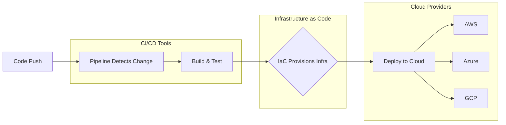

# Architecture Overview

This document explains the project structure, the three main layers, and the design decisions behind the Delivery Platform Lab.

## The Three Layers

The project is organized around three distinct concerns:

### 1. `apps/` — The Applications (the WHAT)

Simple applications that serve as deployment targets. These are intentionally minimal — the focus is on the delivery pipeline, not the app logic.

| App | Stack | Purpose |
|-----|-------|---------|
| `apps/api/` | Node.js + Express 5 | REST API with health check and info endpoints |
| `apps/web/` | React 19 + TypeScript + Vite | Frontend that displays API health status |

### 2. `pipelines/` — The CI/CD Orchestration (the HOW)

Defines the build, test, and deploy workflows. Each subdirectory corresponds to a CI/CD tool.

| Directory | Tool | Description |
|-----------|------|-------------|
| `pipelines/azure-devops/` | Azure Pipelines | YAML-based pipelines with Azure integration |
| `pipelines/github-actions/` | GitHub Actions | Event-driven workflows native to GitHub |
| `pipelines/jenkins/` | Jenkins | Self-hosted automation server with Jenkinsfile |
| `pipelines/circleci/` | CircleCI | Cloud-native CI/CD with orbs ecosystem |

> **Important:** Some CI/CD tools require their configuration files in specific repository locations. For example:
>
> - **GitHub Actions** requires workflow files under `.github/workflows/`
> - **CircleCI** requires its config at `.circleci/config.yml`
>
> In these cases, `pipelines/{tool}/` contains documentation, helper scripts, and auxiliary configs. The actual pipeline definition lives where the tool mandates. Each tool's documentation specifies exactly where to find the config files.

### 3. `infra/` — The Cloud Infrastructure (the WHERE)

Defines the cloud resources needed to run the applications. Two approaches are used side by side:

| Directory | Approach | Tools |
|-----------|----------|-------|
| `infra/terraform/` | Cloud-agnostic IaC | Terraform with provider-specific configs |
| `infra/native/` | Cloud-specific IaC | CloudFormation (AWS), ARM/Bicep (Azure), Deployment Manager (GCP) |

## Dual IaC Approach

The project deliberately uses **two IaC strategies** for learning purposes:

**Terraform (cloud-agnostic)**
- Single language (HCL) across all clouds
- Consistent workflow: `init` → `plan` → `apply`
- Provider abstraction — same concepts, different providers
- Trade-off: less access to cloud-specific features

**Native IaC (cloud-specific)**
- Tighter integration with each cloud's ecosystem
- Access to the latest features without waiting for provider updates
- Trade-off: different language and tooling per cloud (JSON/YAML for CloudFormation, Bicep/JSON for ARM, YAML for Deployment Manager)

## Multi-Cloud Strategy

The same applications are deployed to three clouds:

| Cloud | Terraform | Native IaC |
|-------|-----------|------------|
| AWS | `infra/terraform/aws/` | `infra/native/aws/` (CloudFormation) |
| Azure | `infra/terraform/azure/` | `infra/native/azure/` (ARM / Bicep) |
| GCP | `infra/terraform/gcp/` | `infra/native/gcp/` (Deployment Manager) |

This allows direct comparison of how each cloud handles the same workload, and how each IaC tool expresses the same infrastructure.

## Deployment Flow

The flow works as follows:

1. **Code Push** — A developer pushes code to the repository
2. **Pipeline Detects Change** — The configured CI/CD tool triggers a pipeline run
3. **Build & Test** — The pipeline builds the apps and runs tests
4. **IaC Provisions Infra** — Terraform or native IaC ensures the target cloud environment exists
5. **Deploy** — The built artifacts are deployed to the provisioned infrastructure
